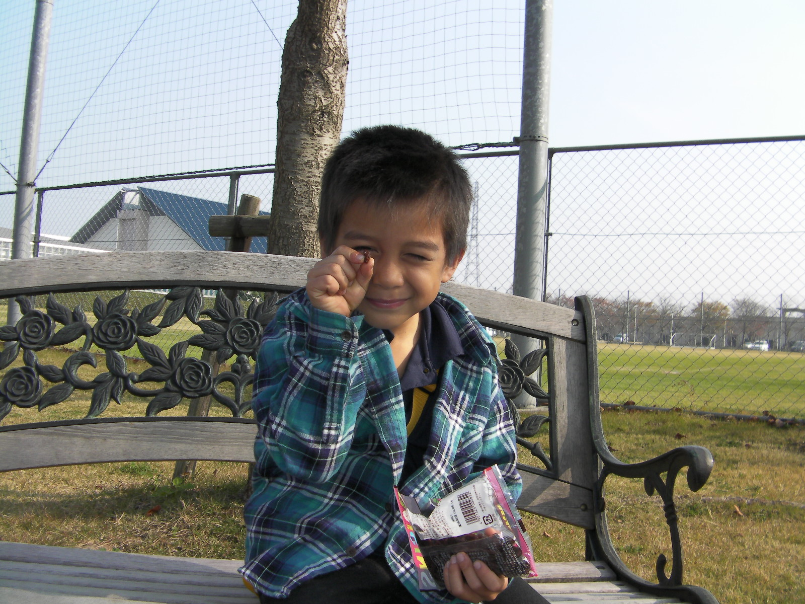

# Hello Internet this is Lucas Sillito

# **Early Life**

I was born in Houston, Texas, where I lived for only a year or two before moving to College Station. I later spent 2 years in Japan when I was four years old, staying there with my grandparents, my mother, and my brother. My mother was pregnant with my little brother at the time, and he was actually born in Japan.

At a park in Koga, Ibaraki

 

Walking trail with my little brother
)">
">

<html>
<head>
    <title>Jobs</title>
</head>
<body>

<table border="1">
    <tr>
        <th>Max</th>
        <th>Jun</th>
        <th>Safiyah</th>
    </tr>
    <tr>
        <td>17 Years Old</td>
        <td>15 Years Old</td>
        <td>12 Years Old</td>
    </tr>
    <tr>
        <td>Born Houston, Texas</td>
        <td>Born Tokyo, Japan </td>
        <td>Born Provo, Utah</td>
    </tr>
</table>

</body>
</html>

